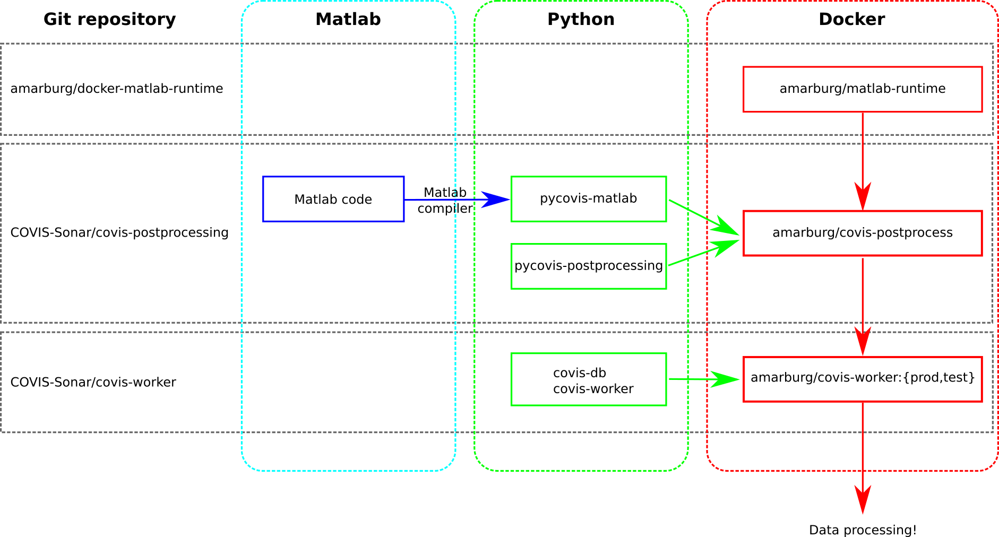

# Software Repositories

The COVIS post-processing software is stored in three public GitHub repositories.  Of these,
_only_ [COVIS-Sonar/covis-postprocessing](https://github.com/COVIS-Sonar/postprocessing) is required for post-processing / analyzing data in Matlab.  The other two repositories ([docker-matlab-runtime](https://github.com/amarburg/docker-matlab-runtime) and [covis-worker](https://github.com/COVIS-Sonar/covis-worker)) are used to run post-processing jobs at scale in a computer cluster.

The relationship between these three repos is shown below.

### [docker-matlab-runtime](https://github.com/amarburg/docker-matlab-runtime)

Builds the Docker image [amarburg/matlab-runtime](https://hub.docker.com/r/amarburg/matlab-runtime/), a Debian-based image with the Matlab compiler runtime pre-installed.

__Needs to be rebuilt:__  Only if changing configuration or upgrading Matlab compiler runtime.

### [covis-postprocessing](https://github.com/COVIS-Sonar/postprocessing)

Contains the Matlab post-processing tools written by the COVIS science team.  These are discussed in more detail in the [README](https://github.com/COVIS-Sonar/postprocessing/blob/master/README.md) in that repository.

The [deploy/](https://github.com/COVIS-Sonar/postprocessing/tree/master/Deploy) subdirectory contains scripts for using the Matlab compiler (`mcc`) to convert the Matlab code into the Python library `pycovis-matlab`.  It also includes a second Python package `pycovis-postprocessing` which contains helper functions.

These two Python packages are installed in the Docker image [amarburg/covis-postprocess](https://hub.docker.com/r/amarburg/covis-postprocess/).  This Docker image can be used to run postprocessing functions on machines without Matlab installed ... see the the [Makefile](https://github.com/COVIS-Sonar/postprocessing/blob/master/Deploy/Makefile) and [scripts/ directory](https://github.com/COVIS-Sonar/postprocessing/tree/master/Deploy/scripts) for examples.

__Needs to be rebuilt:__  Whenever the Matlab code or `pycovis-postprocessing` change.

### [covis-worker](https://github.com/COVIS-Sonar/covis-worker)

Contains Python packages (`covis-db` and `covis-worker`) which relate to scaling `covis-postprocessing` jobs at a cluster scale.  These tools are explored in greater detail ....

__Needs to be rebuilt:__  Whenever the [amarburg/covis-postprocess](https://hub.docker.com/r/amarburg/covis-postprocess/) Docker image or the code in this repo is updated.
